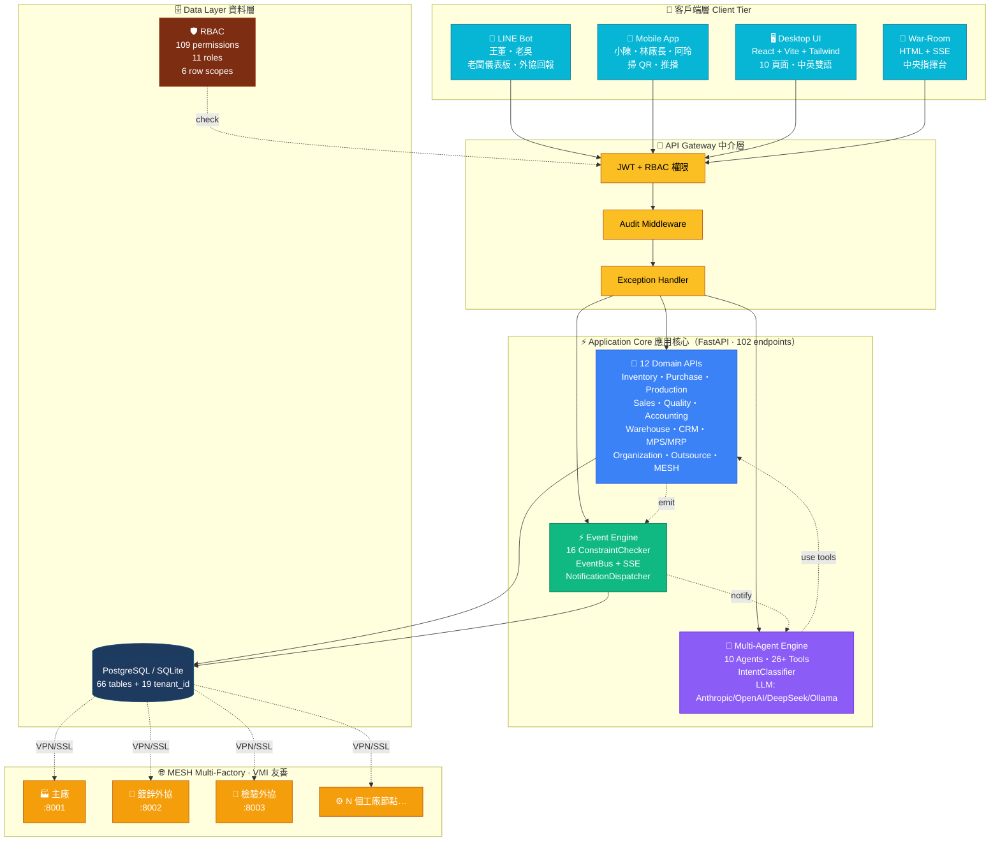

# LLM-ERP 系統架構拓樸圖 — v3.0

> 兩個版本：
> - **`architecture_diagram.svg`**：精美視覺版（可貼簡報、印 A3）
> - **下方 Mermaid**：技術文件版（GitHub / Notion / Markdown 渲染）

> ⚡ **v3.0 戰略軸轉通知**：SVG 與 Mermaid 內仍可能顯示「📱 LINE Bot」「鍍鋅外協」等舊節點。
> v3.0 已刪 mobile / LINE / 外協（功能下架到 Phase 7）。圖示更新待下次重畫，文字描述以本 v3.0 banner 為準。

---

## SVG 預覽

直接打開 [`architecture_diagram.svg`](./architecture_diagram.svg)（瀏覽器或 IDE 預覽）。

---

## Mermaid 版（彩色分層）



---

## 關鍵設計亮點

### 1. 五層分明的分層架構

| 層 | 角色 | 元素 |
|---|---|---|
| **Client** | 觸達使用者 | LINE Bot · Mobile · Desktop · War-Room |
| **API Gateway** | 認證 / 授權 / 稽核 | JWT · RBAC · Audit · Exception |
| **Application Core** | 業務邏輯 | 12 Domains · Multi-Agent · Event Engine |
| **Data** | 持久化 | PostgreSQL / SQLite + RBAC schema |
| **MESH** | 多廠協同 | Factory Nodes · VMI · 資料不外流 |

### 2. 三大核心引擎並列

```
        Domain APIs ←→ Multi-Agent ←→ Event Engine
         (CRUD)       (AI 大腦)       (即時通知)
            ↓             ↓              ↓
         直接呼叫       自然語言       事件驅動
         (HTTP)        (LLM tools)    (SSE/Push)
```

### 3. 多租戶 + MESH 共生

- **單一 codebase**, 一份 Docker
- 透過 `tenant_id` 欄位 + Row-Level Filter 隔離資料
- 工廠節點獨立部署，僅回**聚合結果**

### 4. AI 為一等公民

不是事後加 chatbot，而是：
- **IntentClassifier**：分類使用者意圖
- **Multi-Agent**：10 個 domain 專家
- **Tool Calling**：26+ 個可呼叫工具
- **DecisionLog**：每個 AI 決策可追溯

### 5. 安全為基礎不是補丁

- **架構級 RBAC**：109 個權限碼從 Day 1 就有
- **Row-Level Filter**：業務只看自己客戶
- **多租戶隔離**：MESH 廠別資料牆
- **Audit Trail**：所有寫入操作不可竄改紀錄

---

## 資料流範例：「業務小陳問 AI」

```
1. 小陳手機開 App，問「客戶 A 的歷史單價」
       ↓
2. Mobile → POST /api/chat-v2 (Bearer JWT)
       ↓
3. AuthMiddleware: JWT 解析 → 小陳的 employee_id
       ↓
4. UserContext 載入：sales_rep 角色 + own scope
       ↓
5. IntentClassifier: 「客戶」+「單價」→ sales agent
       ↓
6. LLM 解析 → 呼叫 query_sales_order tool
       ↓
7. Tool 執行 → apply_row_filter(scope=own)
       → SELECT ... WHERE created_by = '小陳' AND customer_id = 'A'
       ↓
8. 回傳 3 筆歷史單價
       ↓
9. LLM 整理回覆「最近 3 次：5/12 $4500、4/20 $4400、3/15 $4300」
       ↓
10. EventBus emit `conversation.completed` → audit_logs + SSE
       ↓
11. 小陳在客戶面前 3 秒拿到答案 ✓
```

---

## 給投資人 / 客戶看的版本

打開 [`architecture_diagram.svg`](./architecture_diagram.svg)，一頁簡報就講完。
A3 列印給工廠老闆，三秒看懂「資料怎麼跑」。
