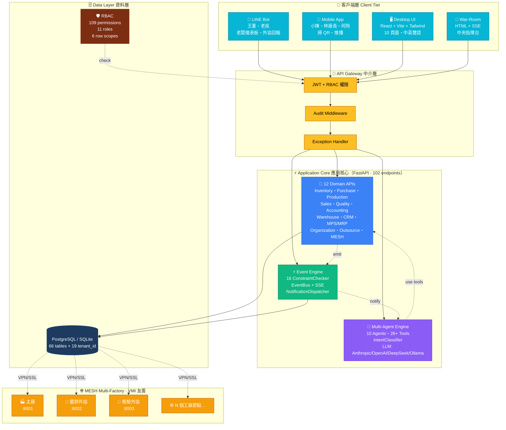

# Ouvoca 系統架構拓樸圖 — v3.0

> 兩個版本：
> - **`architecture_diagram.svg`**：精美視覺版（可貼簡報、印 A3）
> - **下方 Mermaid**：技術文件版（GitHub / Notion / Markdown 渲染）

> ⚡ **v3.0 戰略軸轉通知**：SVG 與 Mermaid 內仍可能顯示「📱 LINE Bot」「鍍鋅外協」等舊節點。
> v3.0 已刪 mobile / LINE / 外協（功能下架到 Phase 7）。圖示更新待下次重畫，文字描述以本 v3.0 banner 為準。

---

## SVG 預覽

直接打開 [`architecture_diagram.svg`](./architecture_diagram.svg)（瀏覽器或 IDE 預覽）。

---

## Mermaid 版（彩色分層）


```mermaid
graph TB
    %% ─── 客戶端層 ───
    subgraph "📱 客戶端層 Client Tier"
        LINE["📱 LINE Bot<br/>王董・老吳<br/>老闆儀表板・外協回報"]
        Mobile["📲 Mobile App<br/>小陳・林廠長・阿玲<br/>掃 QR・推播"]
        Desktop["🖥️ Desktop UI<br/>React + Vite + Tailwind<br/>10 頁面・中英雙語"]
        WarRoom["📡 War-Room<br/>HTML + SSE<br/>中央指揮台"]
    end

    %% ─── 中介層 ───
    subgraph "🔐 API Gateway 中介層"
        Auth["JWT + RBAC 權限"]
        Audit["Audit Middleware"]
        Exc["Exception Handler"]
    end

    %% ─── 應用核心 ───
    subgraph "⚡ Application Core 應用核心（FastAPI · 102 endpoints）"
        Domains["🏢 12 Domain APIs<br/>Inventory・Purchase・Production<br/>Sales・Quality・Accounting<br/>Warehouse・CRM・MPS/MRP<br/>Organization・Outsource・MESH"]
        Agents["🤖 Multi-Agent Engine<br/>10 Agents・26+ Tools<br/>IntentClassifier<br/>LLM: Anthropic/OpenAI/DeepSeek/Ollama"]
        Events["⚡ Event Engine<br/>16 ConstraintChecker<br/>EventBus + SSE<br/>NotificationDispatcher"]
    end

    %% ─── 資料層 ───
    subgraph "🗄️ Data Layer 資料層"
        DB[("PostgreSQL / SQLite<br/>66 tables + 19 tenant_id")]
        RBAC["🛡️ RBAC<br/>109 permissions<br/>11 roles<br/>6 row scopes"]
    end

    %% ─── MESH ───
    subgraph "🌐 MESH Multi-Factory · VMI 友善"
        F1["🏭 主廠<br/>:8001"]
        F2["🔧 鍍鋅外協<br/>:8002"]
        F3["🔬 檢驗外協<br/>:8003"]
        FN["⚙️ N 個工廠節點…"]
    end

    LINE --> Auth
    Mobile --> Auth
    Desktop --> Auth
    WarRoom --> Auth

    Auth --> Audit --> Exc
    Exc --> Domains
    Exc --> Agents
    Exc --> Events

    Domains -.->|emit| Events
    Agents -.->|use tools| Domains
    Events -.->|notify| Agents

    Domains --> DB
    Events --> DB
    RBAC -.->|check| Auth

    DB -. VPN/SSL .-> F1
    DB -. VPN/SSL .-> F2
    DB -. VPN/SSL .-> F3
    DB -. VPN/SSL .-> FN

    classDef client fill:#06b6d4,stroke:#0e7490,color:#fff
    classDef gateway fill:#fbbf24,stroke:#b45309,color:#000
    classDef core fill:#3b82f6,stroke:#1d4ed8,color:#fff
    classDef ai fill:#8b5cf6,stroke:#6d28d9,color:#fff
    classDef event fill:#10b981,stroke:#047857,color:#fff
    classDef data fill:#1e3a5f,stroke:#0c4a6e,color:#fff
    classDef rbac fill:#7c2d12,stroke:#9a3412,color:#fff
    classDef mesh fill:#f59e0b,stroke:#b45309,color:#fff

    class LINE,Mobile,Desktop,WarRoom client
    class Auth,Audit,Exc gateway
    class Domains core
    class Agents ai
    class Events event
    class DB data
    class RBAC rbac
    class F1,F2,F3,FN mesh
```

---

## 關鍵設計亮點

### 1. 五層分明的分層架構

| 層 | 角色 | 元素 |
|---|---|---|
| **Client** | 觸達使用者 | LINE Bot · Mobile · Desktop · War-Room |
| **API Gateway** | 認證 / 授權 / 稽核 | JWT · RBAC · Audit · Exception |
| **Application Core** | 業務邏輯 | 12 Domains · Multi-Agent · Event Engine |
| **Data** | 持久化 | PostgreSQL / SQLite + RBAC schema |
| **MESH** | 多廠協同 | Factory Nodes · VMI · 資料不外流 |

### 2. 三大核心引擎並列

```
        Domain APIs ←→ Multi-Agent ←→ Event Engine
         (CRUD)       (AI 大腦)       (即時通知)
            ↓             ↓              ↓
         直接呼叫       自然語言       事件驅動
         (HTTP)        (LLM tools)    (SSE/Push)
```

### 3. 多租戶 + MESH 共生

- **單一 codebase**, 一份 Docker
- 透過 `tenant_id` 欄位 + Row-Level Filter 隔離資料
- 工廠節點獨立部署，僅回**聚合結果**

### 4. AI 為一等公民

不是事後加 chatbot，而是：
- **IntentClassifier**：分類使用者意圖
- **Multi-Agent**：10 個 domain 專家
- **Tool Calling**：26+ 個可呼叫工具
- **DecisionLog**：每個 AI 決策可追溯

### 5. 安全為基礎不是補丁

- **架構級 RBAC**：109 個權限碼從 Day 1 就有
- **Row-Level Filter**：業務只看自己客戶
- **多租戶隔離**：MESH 廠別資料牆
- **Audit Trail**：所有寫入操作不可竄改紀錄

---

## 資料流範例：「業務小陳問 AI」

```
1. 小陳手機開 App，問「客戶 A 的歷史單價」
       ↓
2. Mobile → POST /api/chat-v2 (Bearer JWT)
       ↓
3. AuthMiddleware: JWT 解析 → 小陳的 employee_id
       ↓
4. UserContext 載入：sales_rep 角色 + own scope
       ↓
5. IntentClassifier: 「客戶」+「單價」→ sales agent
       ↓
6. LLM 解析 → 呼叫 query_sales_order tool
       ↓
7. Tool 執行 → apply_row_filter(scope=own)
       → SELECT ... WHERE created_by = '小陳' AND customer_id = 'A'
       ↓
8. 回傳 3 筆歷史單價
       ↓
9. LLM 整理回覆「最近 3 次：5/12 $4500、4/20 $4400、3/15 $4300」
       ↓
10. EventBus emit `conversation.completed` → audit_logs + SSE
       ↓
11. 小陳在客戶面前 3 秒拿到答案 ✓
```

---

## 給投資人 / 客戶看的版本

打開 [`architecture_diagram.svg`](./architecture_diagram.svg)，一頁簡報就講完。
A3 列印給工廠老闆，三秒看懂「資料怎麼跑」。

---

# 附錄 · 自 README 搬入（v3.70 更新為實測值）

> 以下三節（系統架構 ASCII 圖、領域對照表、檔案結構樹、即時事件流示範）
> 原本在 `README.md` 第 760–818、843–857、884–928 行，為了讓 README 收斂到 400 行以內搬到這裡。
> 搬移時把過時的數字改成 **2026-08-04 實測值**。

## A. 系統架構（ASCII 版）

```
┌──────────────────┐  ┌─────────────┐
│  Desktop UI      │  │  War Room   │
│  (Vite/React +   │  │  (HTML+SSE) │
│   Chat + Confirm)│  │             │
└──────┬───────────┘  └──────┬──────┘
       │                     │
       └─────────────────────┘
                         │ HTTPS + Bearer JWT
              ┌──────────▼───────────┐
              │   FastAPI Backend     │
              │ ┌───────────────────┐ │
              │ │  Auth / Audit MW  │ │
              │ │  RequestID / CSP  │ │
              │ └─────────┬─────────┘ │
              │           │           │
              │  ┌────────▼────────┐  │
              │  │ 31 routers      │  │
              │  │ 242 endpoints   │  │
              │  │ + 17 AI agents  │  │
              │  │ + 201 AI tools  │  │
              │  │ + Event Engine  │  │
              │  │ + SSE stream    │  │
              │  └────────┬────────┘  │
              │           │           │
              │  SQLAlchemy Async + Alembic (001→016) │
              │  107 tables · SQLite(dev) / Postgres(prod) │
              └──────────┬───────────┘
                         │ VPN / structured queries
       ┌─────────────────┼─────────────────┐
       ▼                 ▼                 ▼
  Factory A          Factory B         Factory C
  (FastAPI:8001)    (FastAPI:8002)    (FastAPI:8003)
  Local DB / LLM    Local DB / LLM    Local DB / LLM
  ★ 原始資料不離廠 / Raw data stays local; only aggregates returned (VMI-friendly)
```

🇹🇼 **VMI 友善設計**：每個工廠跑自己的本地 Ouvoca 節點（`factory_node.py`），中央只拿聚合資料、不直接存取原始細目，符合代工廠對「客戶資料保密」的硬性要求。
🇺🇸 **VMI-friendly design**: Each factory runs its own local Ouvoca node (`factory_node.py`); the central instance only receives aggregates, never raw details — meeting the strict data confidentiality requirements of contract manufacturers.

> ⚠️ **部署注意**：`POST /api/factory/aggregate` 目前沒有認證依賴，未登入即可呼叫。
> 多廠部署請放在內網或 VPN 之後，不要直接對外開放。

## B. 領域對照 / Domain Map（31 個 router · 242 個 endpoint）

實測方式：`python -c "from app.main import app"` 後統計 `APIRoute`（2026-08-04）。

| 領域 | API 前綴 | endpoint 數 | 主要模型 / 內容 | AI agent |
|---|---|---:|---|---|
| Auth & Org | `/api/auth`、`/api/organization` | 12 | User, Role, Department, Employee, MFA | — |
| Inventory 庫存 | `/api/inventory` | 10 | Part, Inventory, InventoryTransaction | `inventory` |
| Purchase 採購 | `/api/purchase` | 22 | Supplier, PurchaseOrder, PR, GRN, RFQ, SupplierQuote | `purchase` |
| Production 生產 | `/api/production` | 17 | Product, BOMItem, ProductionOrder, Operation, MaterialIssue | `production` |
| Sales 銷售 | `/api/sales` | 17 | Customer, SalesOrder, DeliveryNote, ReturnNote | `sales` |
| Accounting 會計 | `/api/accounting` | 23 | Account, JournalEntry, AR, SupplierInvoice, PromissoryNote, FixedAsset | `accounting` |
| Warehouse 倉儲 | `/api/warehouse` | 12 | Zone, BinLocation, PickTask, CycleCount, BatchLot, SerialNumber | `warehouse` |
| Quality 品質 | `/api/quality` | 5 | InspectionOrder, NonConformance, CAPA | `quality` |
| MPS / MRP | `/api/mps-mrp` | 6 | MpsMaster, MpsEntry, MrpMaster, MrpItem | `mps_mrp` |
| CRM | `/api/crm` | 8 | Lead, Opportunity, CrmEvent | `crm` |
| Permission 權限 | `/api/permission` | 15 | Permission, Role, Assignment, Override, Tenant | `permission` |
| Approval 審批 | `/api/approvals` | 7 | ApprovalRule, ApprovalRequest, ApprovalStep | `approval` |
| Policy 家規 | `/api/policies` | 9 | PolicyRule + 家規引擎（23 條預設） | — |
| Tax 台灣稅務 | `/api/tax` | 8 | EInvoiceRecord、401/403/405、統編驗證 | `tax` |
| Print 列印 | `/api/print` | 8 | 報價 / PO / SO / 出貨 / 發票 / 檢驗 / 盤點 / 料件標籤 PDF | `print` |
| Export 匯出 | `/api/export` | 12 | Excel / CSV 匯出 | `export` |
| Analytics 分析 | `/api/analytics` | 7 | DSO、庫存週轉、毛利率、OEE、採購集中度、AI 成本 | `analytics` |
| Reports 報表 | `/api/reports` | 3 | AR 帳齡 xlsx、庫存月報 xlsx、401 HTML | — |
| Agents / Chat | `/api/agents`、`/api/chat`、`/api/chat-v2` | 9 | ConfirmCard、工具直呼、對話歷史、評分 | `general` |
| System 系統 | `/api/system` | 7 | 系統組態 14 項、備份管理 | `system` |
| External DB | `/api/external-connections` | 3 | ExternalConnection（AES-256-GCM 加密） | `external_db` |
| Files 檔案 | `/api/files` | 5 | 上傳 / 下載 / 刪除（magic bytes 驗證） | — |
| Events / SSE | `/api/events` | 2 | EventBus + SSE 廣播 | — |
| Email digest | `/api/email-digest` | 3 | 每日摘要預覽 / 寄送 | — |
| Onboarding | `/api/onboarding` | 3 | 示範資料載入 / 清除 / 進度 | — |
| LLM 狀態 | `/api/llm` | 3 | 供應商設定 / 測試 / 狀態 | — |
| MESH 多廠 | `/api/factory` | 5 | 分廠註冊 / 清單 / 聚合查詢 | — |
| Health | `/api/health` | 1 | 健康檢查（公開） | — |
| **合計** | | **242** | **107 張資料表** | **17 agents / 201 tools / 19 domains** |

> AI 工具的 `domain` 分類（19 個）與 API 前綴不完全一一對應，
> 完整工具清單見 [`FEATURES_ZH.md` §10](./FEATURES_ZH.md)。

## C. 檔案結構 / File Layout

```
ouvoca/
├── install_easy.bat / .sh      ← ⭐ 電腦小白安裝（自動下載 Python/Node）
├── install.bat / .sh           ← Docker 安裝
├── start.bat / .sh             ← 日常啟動
├── update.bat / .sh            ← 一鍵更新（先備份再升級）
├── uninstall_easy.bat / .sh    ← 完整移除（含 Windows 註冊表）
├── start_dev.bat / stop_dev.bat← 開發模式（熱重載）
├── build_pdfs.bat / .sh        ← 重新產生 74 份 PDF
├── backend/                    ← FastAPI 後端
│   ├── app/
│   │   ├── core/              ← Base, logging, exceptions, deps, crypto, status_machine
│   │   ├── config.py          ← APP_VERSION 等集中設定
│   │   ├── database.py
│   │   ├── main.py            ← 31 個 router 註冊處
│   │   ├── middleware/        ← auth, audit, request_id, security_headers
│   │   ├── models/            ← 30 支模型檔 / 107 張資料表
│   │   ├── schemas/           ← Pydantic schemas
│   │   ├── services/          ← 41 支商業邏輯（financial_statements, three_way_match, backup, policy_engine…）
│   │   ├── api/               ← 30 支 router / 242 個 endpoint
│   │   ├── events/            ← EventBus, 16+ constraint rules
│   │   ├── integrations/      ← 外部系統串接
│   │   └── agents/            ← engine + registry + domains/（35 支，201 個工具）
│   ├── scripts/               ← 22 支（seed / seed_permissions / seed_accounts / seed_industries…）
│   ├── alembic/versions/      ← v001 → v016 migration
│   ├── tests/                 ← smoke / integration / personas（883 支測試）
│   ├── factory_node.py        ← MESH 節點
│   ├── pyproject.toml         ← requires-python = ">=3.11,<3.13"
│   └── requirements.txt
├── frontend-desktop/           ← React 桌機 UI
│   ├── src/
│   │   ├── lib/api.ts         ← typed API client
│   │   ├── store/auth.ts      ← Zustand auth + persist
│   │   ├── i18n/              ← 中英雙語（各 267 鍵）
│   │   ├── pages/             ← 17 頁（含 Login）
│   │   ├── components/        ← Layout, ConfirmCard, CommandPalette, BomEditor…
│   │   ├── components/ui/     ← GalaxyToggle / GalaxyLoader
│   │   └── styles/galaxy.css
│   ├── package.json
│   └── nginx.conf
├── war-room/                   ← 即時事件儀表板（HTML + SSE）
├── docs/                       ← 101 份 .md + docs/pdf/ 74 份 PDF
│   ├── CHANGELOG_ZH.md         ← 版本紀錄
│   ├── FEATURES_ZH.md          ← 功能完整清單
│   ├── DOCUMENT_INDEX.md       ← 74 份 PDF 索引
│   └── ...
├── scripts/run_gates.sh        ← 4 道自證閘
├── .github/workflows/ci.yml    ← CI（Python 3.12 / Node 20）
├── LICENSE                     ← AGPL-3.0
├── LICENSE-SMALL-BUSINESS.md   ← 🌱 ≤20 人完全免費
├── LICENSE-COMMERCIAL.md       ← 🔵 商業授權說明
├── SECURITY.md / CODE_OF_CONDUCT.md / CLA.md / CONTRIBUTING.md
├── DEPLOYMENT.md               ← 正式上線（含 PostgreSQL 切換）
└── docker-compose.yml
```

## D. 即時事件流示範 / Try the Event Stream

🇹🇼 同時打開兩個視窗：

1. **/events** in the desktop UI（http://localhost:5173/events）
2. **War Room** at http://localhost:8080

從第三個視窗觸發事件（例：`/inventory` 新增料件），兩個 dashboard 都會即時收到 `part.created` 事件。

或用 curl：

```bash
curl -N http://localhost:8000/api/events/stream
```

---

**附錄最後更新**：v3.70（2026-08-04）· 數字皆為程式碼實測
