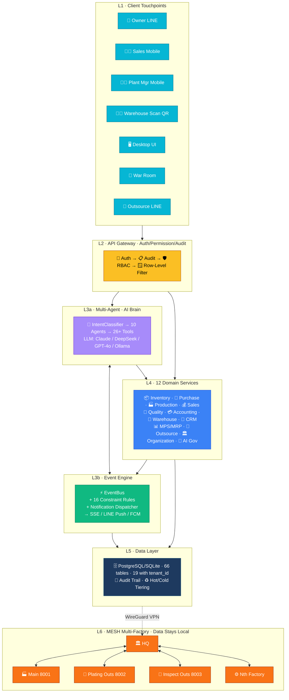
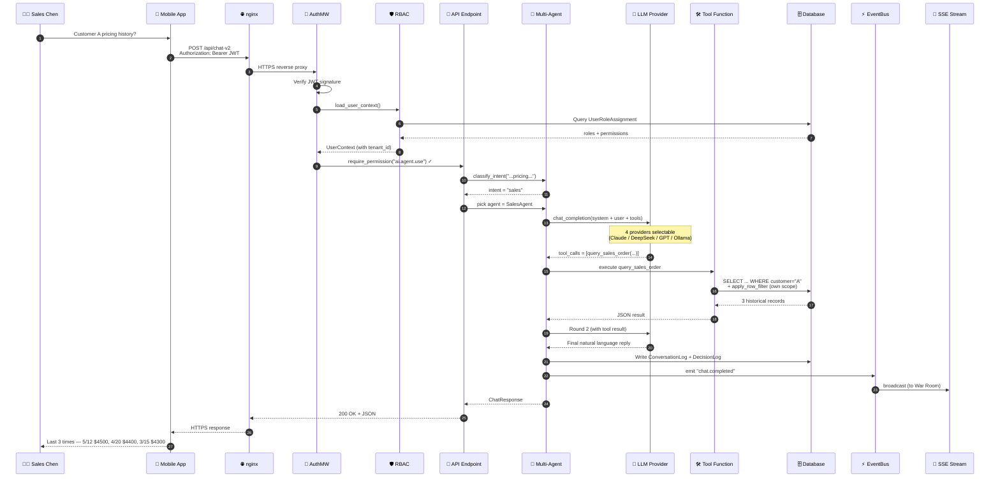
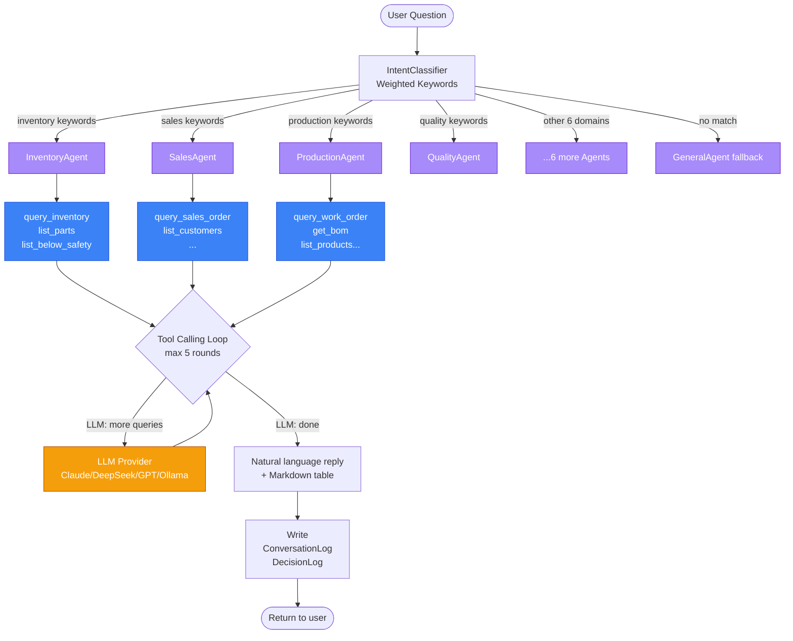
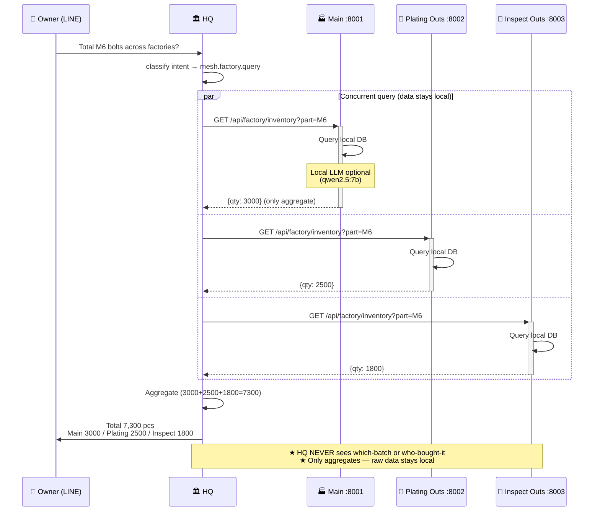
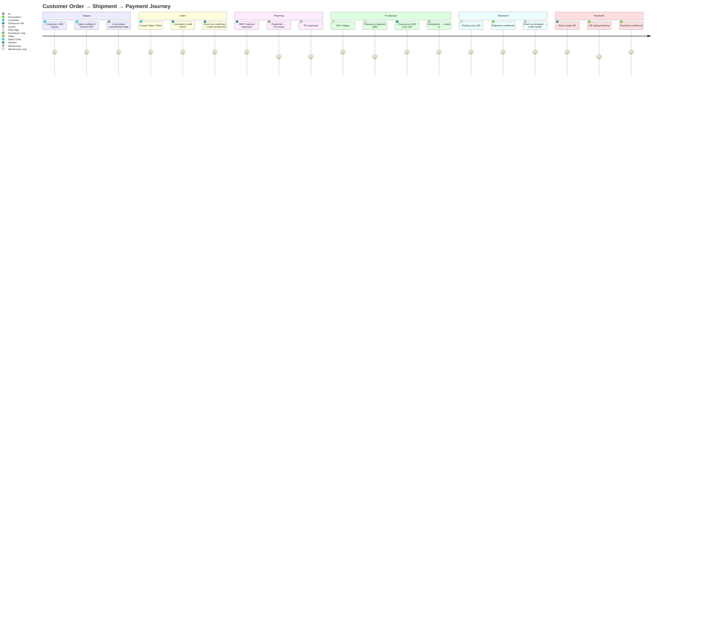

# System Topology & Flow Diagram (English) — v3.0

> **Six perspectives from shallow to deep, static to dynamic** — making LLM-ERP understandable to both technical and non-technical readers.
>
> - **Visual**: [`system_flow_topology.svg`](./system_flow_topology.svg) (beautiful SVG for slides / A3 print)
> - **Static legacy**: [`architecture_diagram.svg`](./architecture_diagram.svg) (5-layer)
>
> **Chinese version**: [`SYSTEM_TOPOLOGY_ZH.md`](./SYSTEM_TOPOLOGY_ZH.md)

> ⚡ **v3.0 Strategic Pivot Notice**: SVG may still show "👴 Outsource LINE / Plating Outsource / Inspection Outsource" nodes.
> v3.0 deprecates outsource / LINE / Mobile (moved to Phase 7). SVG redraw pending Phase 1 completion.

---

## View 1: Six-Layer Overall Architecture (Owner 30-sec scan)

---

## View 2: Full Request Lifecycle (Engineer "how data flows")

**Key flow notes**:
1. **Steps 6-7**: Permission load = single JOIN query, 5-min TTL cache
2. **Step 11**: IntentClassifier uses weighted keywords
3. **Step 14**: LLM tool calling can loop up to 5 rounds
4. **Step 18**: `apply_row_filter` auto-adds `WHERE created_by = chen` (Chen sees only own customers)
5. **Step 23**: All AI decisions written to DecisionLog for audit

---

## View 3: Multi-Agent Internals (AI Engineer)

**Each Agent has scoped tools** — preventing LLM from misfiring cross-domain:
- `InventoryAgent` only sees 4 inventory tools
- `SalesAgent` only sees 4 sales tools
- → Inventory agent cannot accidentally trigger sales operations

---

## View 4: MESH Multi-Factory Flow (Multi-Site Owner)

**Three MESH highlights**:
1. **Data sovereignty**: Each factory's data **physically** stays on-premise
2. **Offline-capable**: Factory keeps working even when HQ disconnects
3. **Infinite scale**: Adding the Nth outsource partner takes 50 lines of config

---

## View 5: Permission Check Flow (Security / IT)

```mermaid
flowchart LR
    Req([HTTP Request<br/>Authorization: Bearer JWT]) --> AuthMW{AuthMiddleware<br/>Public path?}

    AuthMW -->|Yes| Pass1([Skip verification])
    AuthMW -->|No| Verify[Verify JWT]

    Verify --> CheckSig{Signature OK?}
    CheckSig -->|No| Reject401([401 Unauthorized])
    CheckSig -->|Yes| LoadCtx[load_user_context]

    LoadCtx --> CacheHit{Cache hit?<br/>5min TTL}
    CacheHit -->|Yes| FromCache[From cache]
    CacheHit -->|No| QueryDB[Query DB<br/>JOIN UserRoleAssignment]
    QueryDB --> SaveCache[Save to cache]

    FromCache & SaveCache --> UCtx[UserContext<br/>+ permissions dict<br/>+ tenant_id]

    UCtx --> ReqPerm{require_permission<br/>code match}
    ReqPerm -->|No permission| Reject403([403 Permission Denied])
    ReqPerm -->|Has permission| Endpoint[Execute endpoint]

    Endpoint --> RowFilter[apply_row_filter<br/>Auto-add WHERE]
    RowFilter --> ScopeCheck{Scope?}
    ScopeCheck -->|own| OwnQ[WHERE created_by=user]
    ScopeCheck -->|tenant| TenQ[WHERE tenant_id=user.tenant]
    ScopeCheck -->|assigned| AssignQ[WHERE assigned_to=user]
    ScopeCheck -->|all| AllQ[No filter]

    OwnQ & TenQ & AssignQ & AllQ --> DB[(Database)]
    DB --> Response([HTTP 200 + Data])

    classDef reject fill:#ef4444,stroke:#991b1b,color:#fff
    classDef pass fill:#10b981,stroke:#047857,color:#fff
    class Reject401,Reject403 reject
    class Pass1,Response pass
```

**Five layers of permission gates**:
1. **JWT verification**: Is the token valid
2. **UserContext load**: Who are you, what role
3. **require_permission**: Can you do this action
4. **apply_row_filter**: Which rows can you see (Sales A can't see Sales B's customers)
5. **Audit Trail**: Record who did what when

---

## View 6: Typical Business Lifecycle (Inquiry → Payment)

**Events triggered at each stage**:

| Stage | Event | Auto Action |
|---|---|---|
| Inquiry | `chat.completed` | DecisionLog records AI recommendation |
| Order | `so.confirmed` | Notify production_manager |
| Planning | `mrp.generated` | Push to purchaser |
| Purchase | `po.approved` | Notify supplier + warehouse |
| Production | `wo.released` | Push to plant_manager + operators |
| Outsource | `outsource.completed` | Push to warehouse + accounting |
| Shipment | `so.shipped` | LINE push to owner, auto-create AR |
| Payment | `payment.received` | Notify sales + accounting |

---

## Tech / Business Dual-Track Summary

| Dimension | Tech View | Business View |
|---|---|---|
| **L1 Client** | React/Expo/HTML+SSE | Owner / Sales / Plant Mgr / Outsource |
| **L2 API Gateway** | FastAPI Middleware Stack | "Identity verified before entry" |
| **L3a Multi-Agent** | IntentClassifier + Tool Calling | "AI auto-finds the right function" |
| **L3b Event Engine** | EventBus + Constraint Rules | "Anomalies push automatically" |
| **L4 Domain** | 12 service modules | "12 business domains integrated" |
| **L5 Data** | PostgreSQL + Row-Level | "Data isolated by factory & user" |
| **L6 MESH** | WireGuard + Aggregate Query | "Outsource data stays at outsource" |

---

## Reading Order by Role

| Reader | Suggested Order |
|---|---|
| 👔 **Owner** | View 1 (30s scan) → View 6 (business journey) |
| 👨‍💼 **Sales** | View 6 → View 2 (one request lifecycle) |
| 🧑‍💻 **Developer** | View 2 → View 3 (Multi-Agent) → View 5 (Permission) |
| 🛡️ **IT/Security** | View 5 (Permission) → View 4 (MESH) |
| 🌐 **Multi-Site Mgr** | View 4 (MESH) → View 1 (overview) |

---

## Related Documents

- 📐 [`ARCHITECTURE_DIAGRAM.md`](./ARCHITECTURE_DIAGRAM.md) — Static 5-layer
- 📡 [`NETWORK_DEPLOYMENT_EN.md`](./NETWORK_DEPLOYMENT_EN.md) — Network deployment
- 🛡️ [`PERMISSION_MODEL.md`](./PERMISSION_MODEL.md) — Permission model
- 🤖 [`LLM_BENCHMARK_REPORT_EN.md`](./LLM_BENCHMARK_REPORT_EN.md) — LLM benchmark
- 🏗️ [`ARCHITECTURE_DECISIONS.md`](./ARCHITECTURE_DECISIONS.md) — ADRs

---

**Last updated**: 2026-05-14
**Chinese version**: [`SYSTEM_TOPOLOGY_ZH.md`](./SYSTEM_TOPOLOGY_ZH.md)
