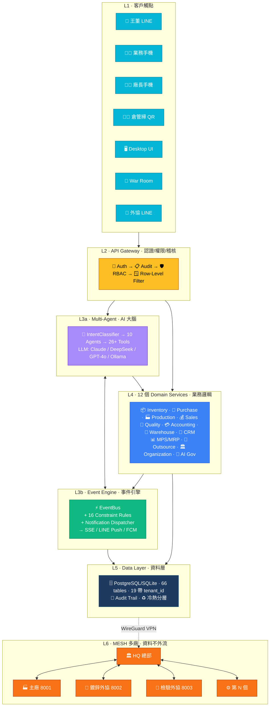
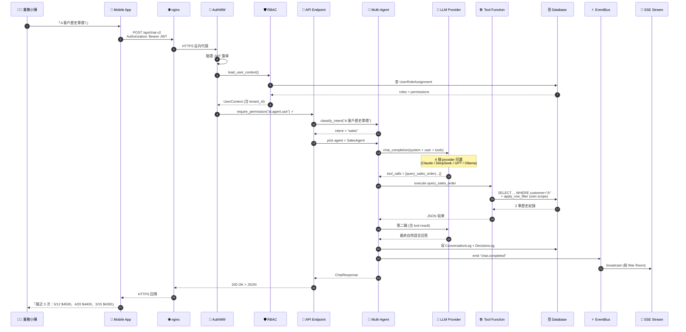
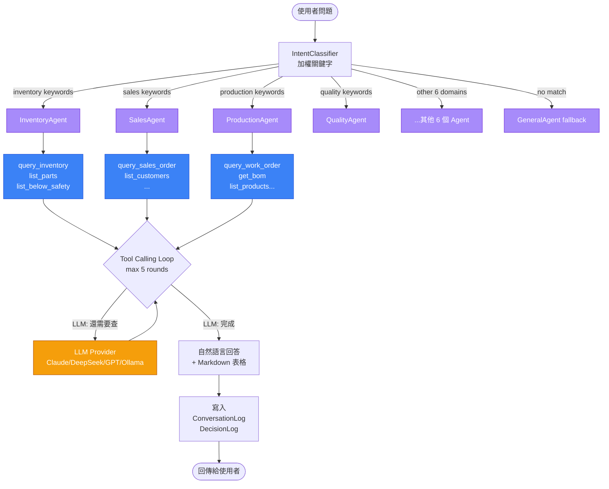
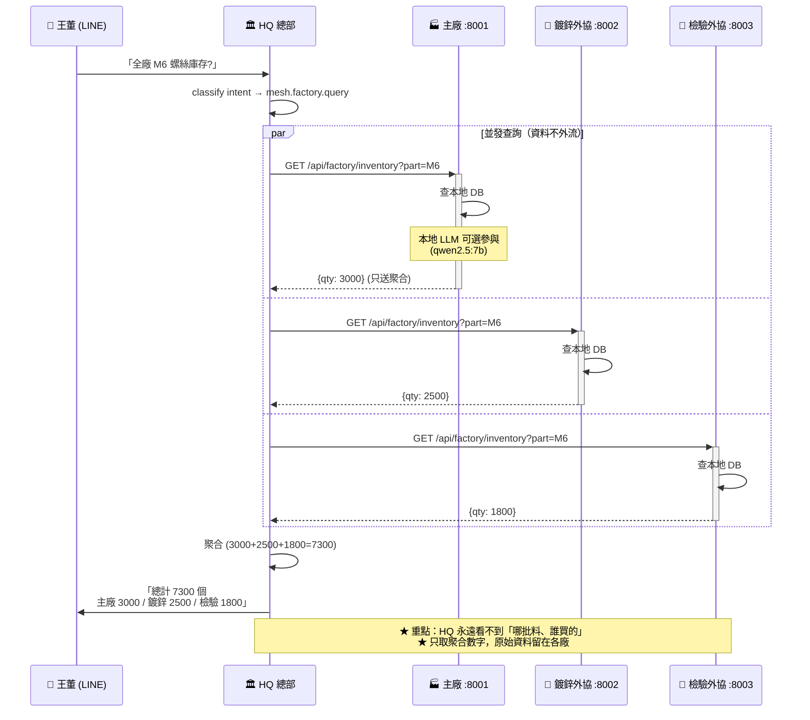
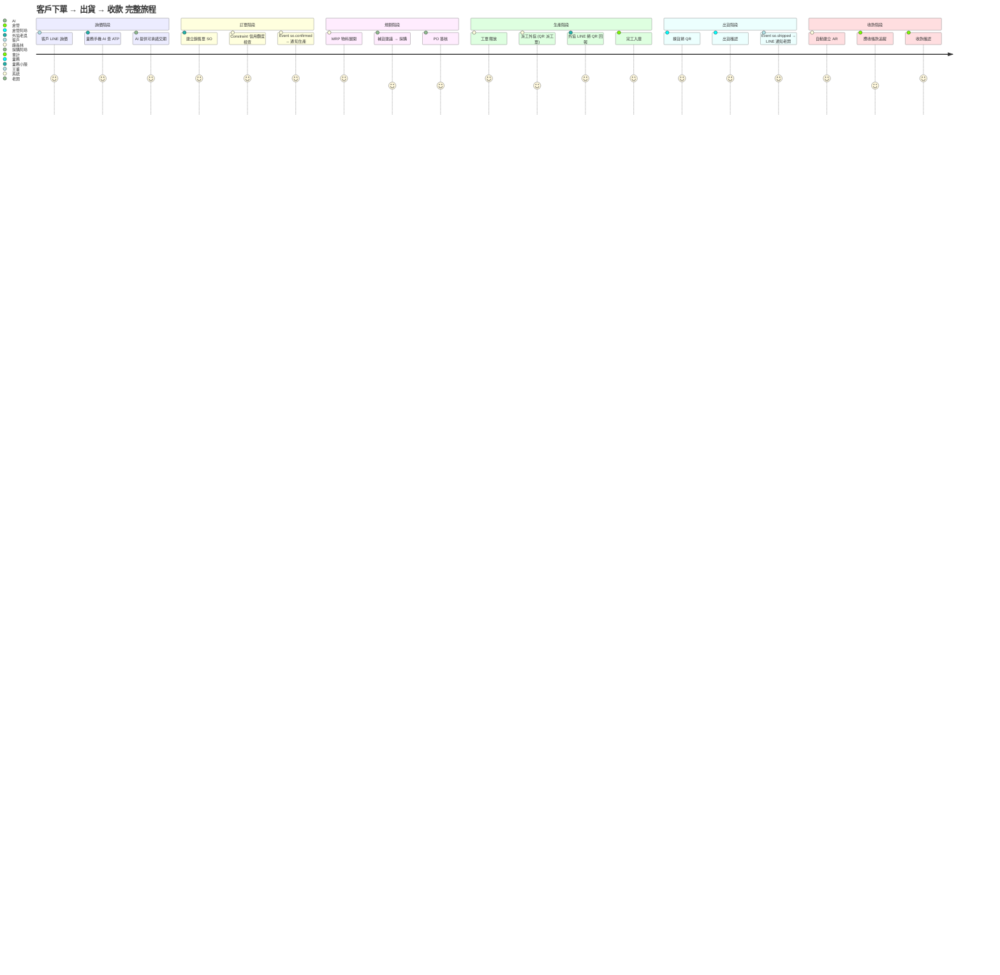

# 系統架構流程關聯拓樸圖（繁體中文）

> **本檔提供六種視角**，由淺入深、由靜態到動態，讓技術與非技術讀者都能掌握 LLM-ERP 全貌。
>
> - **視覺版**：[`system_flow_topology.svg`](./system_flow_topology.svg)（精美 SVG，可貼簡報、印 A3）
> - **舊版靜態圖**：[`architecture_diagram.svg`](./architecture_diagram.svg)（5 層分層）
>
> **對應英文版**：[`SYSTEM_TOPOLOGY_EN.md`](./SYSTEM_TOPOLOGY_EN.md)

---

## 視角 1：六層整體架構（給老闆看 30 秒懂）

---

## 視角 2：一個請求的完整生命週期（給工程師看「資料怎麼跑」）

**關鍵流程說明**：
1. **第 6-7 步**：權限載入是 single JOIN query，5 分鐘 TTL cache（不每次都查 DB）
2. **第 11 步**：IntentClassifier 用加權關鍵字（「客戶」+「單價」→ sales）
3. **第 14 步**：LLM tool calling 可循環最多 5 round
4. **第 18 步**：`apply_row_filter` 自動加 `WHERE created_by = 小陳`（小陳看不到別人的客戶）
5. **第 23 步**：所有 AI 決策都寫 DecisionLog，事後可稽核

---

## 視角 3：Multi-Agent 內部運作（給 AI 工程師看）

**Agent 各擁有 scoped tools**——避免 LLM 誤呼叫跨領域工具：
- `InventoryAgent` 只看到 4 個庫存相關 tools
- `SalesAgent` 只看到 4 個銷售相關 tools
- 換言之：庫存代理人不會誤觸發銷售操作

---

## 視角 4：MESH 多廠協同流程（給多廠老闆看）

**MESH 三大特色**：
1. **資料主權**：每廠資料**物理上**留在自己廠內
2. **離線可用**：工廠斷網仍可本地運作
3. **可無限擴展**：第 N 個外協廠加入只需 WireGuard 設定 + 50 行 config

---

## 視角 5：權限檢查流程（給資安 / IT 看）

```mermaid
flowchart LR
    Req([HTTP Request<br/>Authorization: Bearer JWT]) --> AuthMW{AuthMiddleware<br/>路徑是公開?}

    AuthMW -->|是| Pass1([跳過驗證])
    AuthMW -->|否| Verify[驗證 JWT]

    Verify --> CheckSig{簽章 OK?}
    CheckSig -->|否| Reject401([401 Unauthorized])
    CheckSig -->|是| LoadCtx[load_user_context]

    LoadCtx --> CacheHit{快取命中?<br/>5min TTL}
    CacheHit -->|是| FromCache[從 cache 取]
    CacheHit -->|否| QueryDB[Query DB<br/>JOIN UserRoleAssignment]
    QueryDB --> SaveCache[寫入 cache]

    FromCache & SaveCache --> UCtx[UserContext<br/>+ permissions dict<br/>+ tenant_id]

    UCtx --> ReqPerm{require_permission<br/>code 比對}
    ReqPerm -->|無此權限| Reject403([403 Permission Denied])
    ReqPerm -->|有權限| Endpoint[執行 endpoint]

    Endpoint --> RowFilter[apply_row_filter<br/>自動加 WHERE]
    RowFilter --> ScopeCheck{Scope?}
    ScopeCheck -->|own| OwnQ[WHERE created_by=user]
    ScopeCheck -->|tenant| TenQ[WHERE tenant_id=user.tenant]
    ScopeCheck -->|assigned| AssignQ[WHERE assigned_to=user]
    ScopeCheck -->|all| AllQ[無過濾]

    OwnQ & TenQ & AssignQ & AllQ --> DB[(資料庫)]
    DB --> Response([HTTP 200 + Data])

    classDef reject fill:#ef4444,stroke:#991b1b,color:#fff
    classDef pass fill:#10b981,stroke:#047857,color:#fff
    class Reject401,Reject403 reject
    class Pass1,Response pass
```

**5 層權限把關**：
1. **JWT 驗證**：是不是合法 token
2. **UserContext 載入**：你是誰、什麼角色
3. **require_permission**：能不能做這個動作
4. **apply_row_filter**：能看到哪些資料（業務 A 看不到業務 B 的客戶）
5. **Audit Trail**：紀錄誰在何時做了什麼

---

## 視角 6：典型業務生命週期（從詢價到收款）

**每個階段觸發的 Event**：

| 階段 | 觸發事件 | 自動動作 |
|---|---|---|
| 詢價 | `chat.completed` | DecisionLog 紀錄 AI 推薦 |
| 訂單 | `so.confirmed` | 通知 production_manager |
| 規劃 | `mrp.generated` | 推給 purchaser |
| 採購 | `po.approved` | 通知 supplier + warehouse |
| 生產 | `wo.released` | 推給 plant_manager + operators |
| 外協 | `outsource.completed` | 推給 warehouse + accounting |
| 出貨 | `so.shipped` | 推 LINE 給老闆、自動建 AR |
| 收款 | `payment.received` | 通知 sales + accounting |

---

## 技術 / 業務雙軌總表

| 維度 | 技術視角 | 業務視角 |
|---|---|---|
| **L1 客戶端** | React/Expo/HTML+SSE | 王董 / 業務 / 廠長 / 外協 |
| **L2 API Gateway** | FastAPI Middleware Stack | 「進來前都驗證身份」 |
| **L3a Multi-Agent** | IntentClassifier + Tool Calling | 「AI 自動找對的功能用」 |
| **L3b Event Engine** | EventBus + Constraint Rules | 「異常自動推播」 |
| **L4 Domain** | 12 個 service modules | 「12 個業務領域整合」 |
| **L5 Data** | PostgreSQL + Row-Level | 「資料分廠別、分業務」 |
| **L6 MESH** | WireGuard + 聚合查詢 | 「外協廠資料留在外協廠」 |

---

## 給不同讀者的閱讀順序

| 讀者 | 建議順序 |
|---|---|
| 👔 **老闆** | 視角 1（30 秒懂）→ 視角 6（業務旅程） |
| 👨‍💼 **業務** | 視角 6 → 視角 2（一個請求生命週期）|
| 🧑‍💻 **開發者** | 視角 2 → 視角 3（Multi-Agent）→ 視角 5（權限）|
| 🛡️ **IT/資安** | 視角 5（權限）→ 視角 4（MESH）|
| 🌐 **多廠主管** | 視角 4（MESH）→ 視角 1（全景）|

---

## 對應文件

- 📐 [`ARCHITECTURE_DIAGRAM.md`](./ARCHITECTURE_DIAGRAM.md) — 靜態 5 層架構
- 📡 [`NETWORK_DEPLOYMENT_ZH.md`](./NETWORK_DEPLOYMENT_ZH.md) — 網路部署
- 🛡️ [`PERMISSION_MODEL.md`](./PERMISSION_MODEL.md) — 權限模型
- 🤖 [`LLM_BENCHMARK_REPORT_ZH.md`](./LLM_BENCHMARK_REPORT_ZH.md) — LLM 評比
- 🏗️ [`ARCHITECTURE_DECISIONS.md`](./ARCHITECTURE_DECISIONS.md) — ADR

---

**最後更新**：2026-05-14
**英文版**：[`SYSTEM_TOPOLOGY_EN.md`](./SYSTEM_TOPOLOGY_EN.md)
